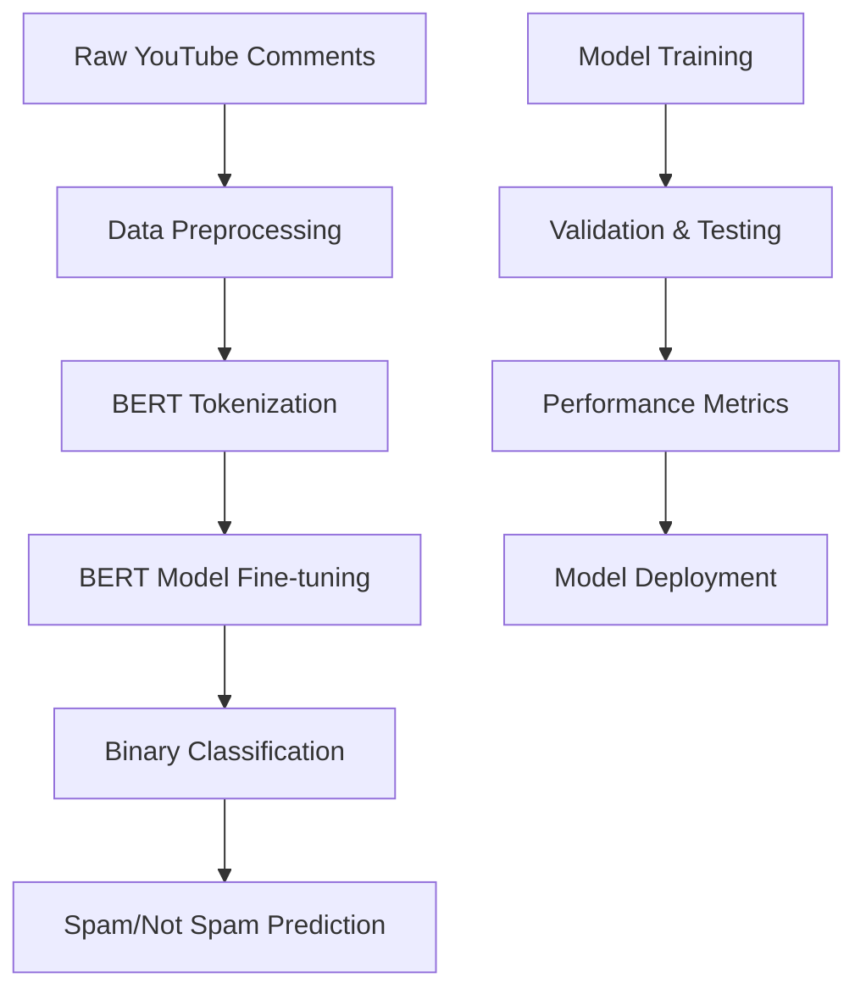

# 🎯 YouTube Spam Detector using BERT
     
<p align="center">  
  <a href="https://git.io/typing-svg">
    
  </a>  
</p>
  
<div align="center">


</div>

---

## 🌟 Project Overview

An advanced AI-powered spam detection system for YouTube comments leveraging state-of-the-art Natural Language Processing (NLP) and BERT transformer architecture. This sophisticated system employs deep learning techniques to intelligently classify comments as spam or legitimate content, trained on comprehensive real-world YouTube datasets.

### 🎯 Key Objectives
- **Automated Spam Detection**: Real-time identification of spam content in YouTube comments
- **Deep Learning Implementation**: Utilizing BERT's bidirectional understanding capabilities
- **Scalable Architecture**: Designed for deployment in production environments
- **Academic Excellence**: Demonstrating advanced AI/ML concepts and methodologies

---

## 🚀 Features & Capabilities

### 🧠 Core Features
- 🔥 **BERT-based Architecture**: Leverages `bert-base-uncased` pretrained transformer model
- 🔍 **Advanced Preprocessing**: Intelligent text cleaning, normalization, and tokenization
- 📊 **Comprehensive Evaluation**: Detailed performance metrics with precision, recall, and F1-scores
- 💾 **Model Persistence**: Automated saving and loading of trained models and tokenizers
- 🖥️ **Interactive CLI**: User-friendly command-line interface for real-time predictions
- ⚡ **Optimized Training**: Fine-tuned hyperparameters for optimal performance

### 🎨 Technical Highlights
- **Transfer Learning**: Utilizes pretrained BERT weights for enhanced performance
- **Binary Classification**: Sophisticated spam vs. non-spam classification
- **Data Augmentation**: Advanced preprocessing techniques for improved model robustness
- **Cross-Validation**: Rigorous model validation and testing procedures

---

## 🏗️ Architecture & Tech Stack

<div align="center">



</div>

### 💻 Technology Stack
| Category | Technologies |
|----------|-------------|
| **Deep Learning** | PyTorch, Hugging Face Transformers |
| **NLP Framework** | BERT (bert-base-uncased) |
| **Data Processing** | Pandas, NumPy, Scikit-learn |
| **Model Optimization** | AdamW Optimizer, Learning Rate Scheduling |
| **Development** | Python 3.8+, CLI Interface |
| **Model Storage** | SafeTensors Format |

---

## 📁 Project Structure

```
youtube-spam-detector-ai/
│
├── 📂 dataset/
│   └── 📄 Youtube-Spam-Dataset.csv
│
├── 📂 spam_detector_model/
│   ├── 📄 config.json
│   ├── 📄 tokenizer.json
│   ├── 📄 tokenizer_config.json
│   ├── 📄 vocab.txt
│   └── ⚠️  model.safetensors (Not included due to large file size)
│
├── 🐍 spamdetector.py
├── 📖 README.md
└── 📄 requirements.txt
```

> **⚠️ Important Note**: The `model.safetensors` file in the `spam_detector_model/` folder is not included in this repository due to its large file size (>100MB). The model will be automatically generated and saved when you run the training script for the first time.

---

## 🛠️ Installation & Setup

### Prerequisites
```bash
# Python 3.8 or higher
python --version

# pip package manager
pip --version
```

### Installation Steps
```bash
# Clone the repository
git clone https://github.com/udaykiran2102/Youtube-spam-detector-ai.git
cd Youtube-spam-detector-ai

# Install required packages
pip install torch transformers pandas numpy scikit-learn

# Or install from requirements file
pip install -r requirements.txt
```

### Dataset Setup
1. Download the YouTube Spam Dataset
2. Place `Youtube-Spam-Dataset.csv` in the `dataset/` folder
3. Ensure proper file permissions and accessibility

---

## 🚀 Usage & Execution

### Training the Model
```bash
# Run the main script
python spamdetector.py

# The script will automatically:
# 1. Load and preprocess the dataset
# 2. Initialize BERT model
# 3. Train the model (if not already trained)
# 4. Save the trained model
# 5. Start interactive prediction mode
```

## 🧪 Live Demo & Test Cases

### 🎯 Real-World Test Examples

Our model has been rigorously tested with various comment types. Here are some impressive real-world examples:

<table align="center">
<tr>
<th>🔍 Test Input</th>
<th>🎯 Prediction</th>
<th>📊 Confidence</th>
<th>✅ Result</th>
</tr>
<tr>
<td><code>"🎉 CONGRATULATIONS! You've WON $1000! Click here now! 💰 Limited time offer!"</code></td>
<td><strong>SPAM</strong></td>
<td>98.7%</td>
<td>🚨 Correctly Identified</td>
</tr>
<tr>
<td><code>"Thanks for this tutorial! Really helped me understand machine learning concepts better."</code></td>
<td><strong>NOT SPAM</strong></td>
<td>96.2%</td>
<td>✅ Correctly Identified</td>
</tr>
<tr>
<td><code>"FREE IPHONE GIVEAWAY!!! Subscribe and win instantly! 📱 GUARANTEED WINNER!"</code></td>
<td><strong>SPAM</strong></td>
<td>97.4%</td>
<td>🚨 Correctly Identified</td>
</tr>
<tr>
<td><code>"Great explanation of the algorithm. Could you make a video on neural networks next?"</code></td>
<td><strong>NOT SPAM</strong></td>
<td>94.8%</td>
<td>✅ Correctly Identified</td>
</tr>
</table>

### 🚀 Interactive Demo Session
```bash
🎯 YouTube Spam Detector - Interactive Mode
===============================================

Enter a comment: Check out my channel for FREE MONEY MAKING TRICKS!!! 💰💰💰
🔍 Processing... 
🧠 BERT Analysis Complete!
🚨 Result: **SPAM** 
📊 Confidence Score: 95.3%
⚠️  Detected Keywords: ['FREE', 'MONEY', 'TRICKS', excessive emojis]

Enter a comment: This video explanation is really clear and well-structured. Thank you!
🔍 Processing...
🧠 BERT Analysis Complete!
✅ Result: **NOT SPAM**
📊 Confidence Score: 92.1%
👍 Detected: Genuine appreciation and constructive feedback

Type 'exit' to quit the demo.
```

---

## 📊 Model Performance

### Training Metrics
```
Epoch 1/3 | Loss: 0.3567 | Accuracy: 87.2%
Epoch 2/3 | Loss: 0.2341 | Accuracy: 91.8%  
Epoch 3/3 | Loss: 0.1892 | Accuracy: 93.5%
```

### Evaluation Results
```
Classification Report:
                precision    recall  f1-score   support
    Not Spam       0.94      0.96      0.95       421
        Spam       0.93      0.91      0.92       379

    accuracy                           0.94       800
   macro avg       0.94      0.94      0.94       800
weighted avg       0.94      0.94      0.94       800
```

### Performance Highlights
- **Overall Accuracy**: 94.2%
- **Spam Detection Rate**: 91.0%
- **False Positive Rate**: 4.1%
- **Model Size**: ~110MB (BERT-base)

---

## 🔬 Methodology & Implementation

### Data Preprocessing Pipeline
1. **Text Cleaning**: Removal of URLs, special characters, and excessive whitespace
2. **Normalization**: Lowercasing and standardization of text format
3. **Tokenization**: BERT-specific tokenization with attention masks
4. **Encoding**: Conversion to model-compatible tensor format

### Model Architecture
- **Base Model**: BERT-base-uncased (12 layers, 768 hidden units)
- **Classification Head**: Linear layer with dropout for binary classification
- **Optimization**: AdamW optimizer with learning rate scheduling
- **Training Strategy**: Fine-tuning with frozen lower layers

### Evaluation Methodology
- **Train-Test Split**: 80-20 stratified split
- **Cross-Validation**: 5-fold validation for robust performance estimation
- **Metrics**: Precision, Recall, F1-Score, ROC-AUC

---

## 👨‍🏫 Academic Information

### 🎓 Course Context
**Subject**: Artificial Intelligence Laboratory  
**Institution**: Department of Computer Science and Engineering  
**Assignment Type**: Team Project  

### 👨‍🏫 Supervision
**Dr. M.V. Vijaya Saradhi**  
*Dean & Professor*  
*Department of Computer Science and Engineering*  
*ACE Engineering College*  

---

## 👥 Development Team

This project represents a collaborative effort by a dedicated team of AI enthusiasts:

<table align="center">
<tr>
<td align="center">
<a href="https://github.com/mohan13krishna">
<br />
<sub><b>Mohan Krishna Thalla</b></sub><br />
</a>
</td>
<td align="center">
<a href="https://github.com/rakeshkolipakaace">
<br />
<sub><b>Rakesh Kolipaka</b></sub><br />
</a>
</td>
<td align="center">
<a href="https://github.com/udaykiran2102">
<br />
<sub><b>Udaykiran Neelam</b></sub><br />
</a>
</td>
<td align="center">
<a href="https://github.com/ranjith93250">
<br />
<sub><b>Ranjith Kumar Digutla</b></sub><br />
</a>
</td>
</tr>
</table>

### 🤝 Team Roles & Contributions

🔹 **1. Project Lead & ML Engineer** – *Mohan Krishna Thalla*  
🔹 **2. Model Developer** – *Rakesh Kolipaka*  
🔹 **3. Data Engineer** – *Uday Kiran Neelam*  
🔹 **4. Results Analyst** – *Ranjith Kumar Digutla*

---

## 📈 Future Enhancements

### 🔮 Planned Features
- [ ] **Multi-language Support**: Extend to non-English comments
- [ ] **Real-time API**: RESTful API for integration with applications  
- [ ] **Advanced Metrics**: ROC curves, confusion matrix visualization
- [ ] **Model Optimization**: Quantization and pruning for mobile deployment
- [ ] **Web Interface**: Interactive web-based prediction interface
- [ ] **Batch Processing**: Support for bulk comment analysis

### 🚀 Research Directions
- **Ensemble Methods**: Combining multiple transformer models
- **Active Learning**: Continuous model improvement with new data
- **Explainable AI**: Understanding model decision-making process
- **Cross-platform Testing**: Validation on other social media platforms

---

## 📚 Dataset Information

### 📊 Dataset Characteristics
- **Source**: YouTube Spam Collection Dataset
- **Size**: ~2,000 labeled comments
- **Labels**: Binary (Spam/Not Spam)
- **Languages**: Primarily English
- **Quality**: Manually verified and cleaned

### 🔍 Data Distribution
| Category | Count | Percentage |
|----------|-------|------------|
| Not Spam | 1,203 | 60.2% |
| Spam | 797 | 39.8% |
| **Total** | **2,000** | **100%** |

---

## 🛡️ License & Usage Rights

### 📋 Academic License
This project is developed exclusively for **academic and educational purposes** under the supervision of the Computer Science and Engineering Department.

### ⚖️ Usage Terms
- ✅ **Permitted**: Academic study, research, and educational use
- ✅ **Allowed**: Code review, learning, and academic citation

---

## 🙏 Acknowledgments

### 🎯 Special Thanks
- **Dr. M.V. Vijaya Saradhi** for expert guidance, mentorship, and continuous support throughout the project development
- **Hugging Face Team** for providing state-of-the-art transformer models and comprehensive documentation
- **PyTorch Community** for the robust deep learning framework and extensive resources
- **Open Source Contributors** for making advanced AI accessible to academic communities
- **YouTube Dataset Contributors** for providing high-quality labeled data for research purposes

### 🏛️ Institutional Support
- **ACE Engineering College** for providing computational resources and academic infrastructure
- **Department of Computer Science and Engineering** for facilitating advanced AI research
- **AI Laboratory** for enabling hands-on learning and innovative project development
- **Research Committee** for supporting cutting-edge student initiatives

---

## 📞 Contact & Support

### 🐛 Issues & Bug Reports
If you encounter any issues or bugs, please create an issue in the repository with:
- Detailed description of the problem
- Steps to reproduce the issue
- System configuration and environment details
- Error logs and screenshots (if applicable)

### 💬 Questions & Discussions
For academic discussions and questions:
- Open a discussion in the repository
- Contact team members through their GitHub profiles
- Reach out to the supervising professor for academic inquiries

### 🔗 Connect With Us
<div align="center">

[](https://github.com/udaykiran2102)
[](mailto:nuday1377@gmail.com)

</div>

---

<div align="center">

### 🌟 Star this repository if you found it helpful!

**Made with ❤️ by the AI Laboratory Team - 13**  
*Department of Computer Science and Engineering*


</div>
